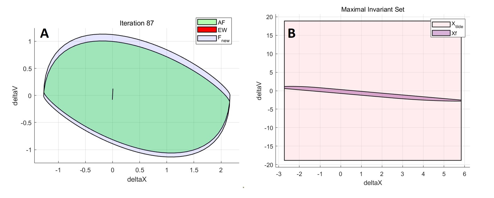
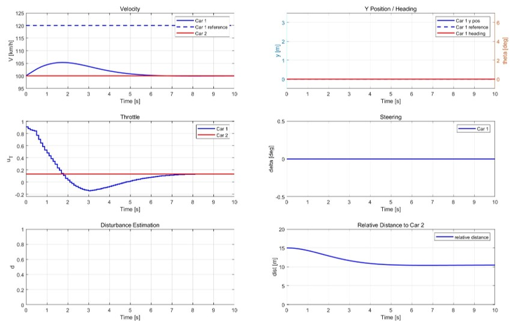
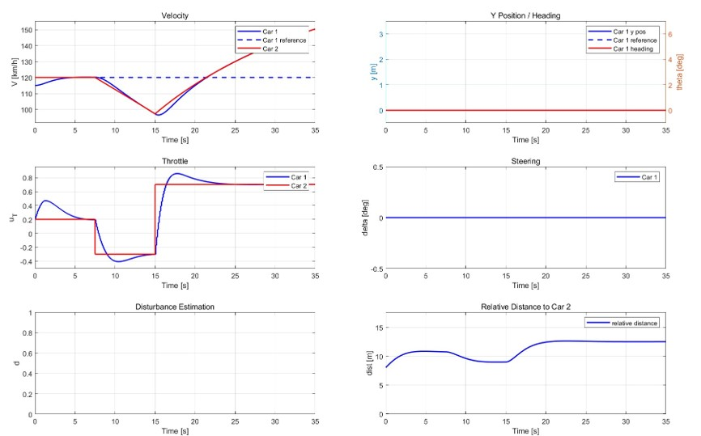

# Part5

## 1. Setup
All the tests are conducted on a environment equipped with Matlab R2024a.  

## 2. Set Construction
Run the `tube_mpc_sets.m`. Then maximum invariant set and terminal set are visualized.

## 3. Easy Tracking Test
Run the `Deliverable_5_1.m` and it shows the easy tracking results.

## 4. Hard Tracking Test
Run the `Deliverable_5_2.m` and it shows the hard tracking results.

## 5. Contact
If you have any questions, please feel free to contac  Mengze TIAN(<mengze.tian@epfl.ch>).
