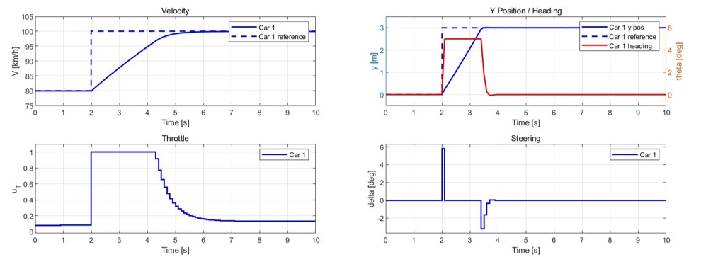
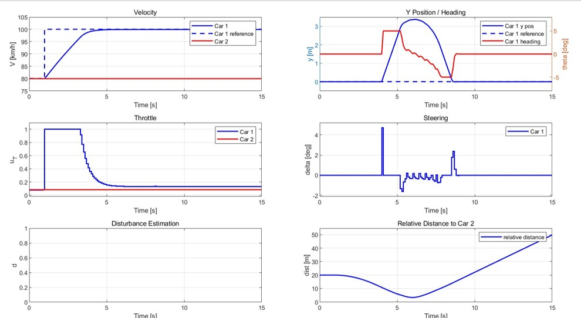

# Part6

## 1. Setup
All the tests are conducted on a environment equipped with Matlab R2024a.  

## 2. Tracking Test
Run the `Deliverable_6_1.m` and it shows the easy tracking results.

## 3. Overtaking Test
Run the `Deliverable_6_2.m` and it shows the hard tracking results.

## 4. Contact
If you have any questions, please feel free to contac  Mengze TIAN(<mengze.tian@epfl.ch>).
